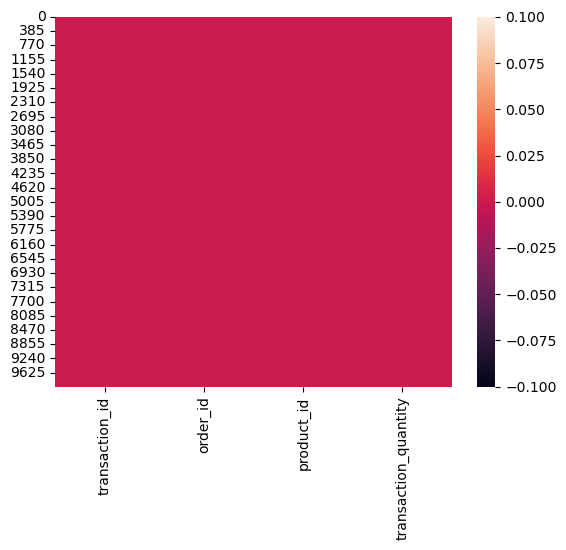

<center><span style="color: #b967ff; font-family: cursive; font-size: 28px;" >1. Import useful libraries 📚</span><center/>


```python
import pandas as pd
import numpy as np
import matplotlib.pyplot as plt
import seaborn as sns
import os
print('imported succesfully!')
```

    imported succesfully!
    

----------------------

<center><span style="color: #b967ff; font-family: cursive; font-size: 28px;" >2. Import the files 🧩</span><center/>


```python
source_path = r'C:\Users\user\Desktop\Digikala Task\tasks'
files_list = ['customers.pickle', 'orders.pickle', 'products.pickle', 'transactions.pickle']
dataframes = {}
for file in files_list:
    file_name = file.split('.')[0]
    df = pd.read_pickle(source_path + '/' + file)
    dataframes[file_name] = df
```


```python
customers = dataframes['customers']
orders = dataframes['orders']
products = dataframes['products']
transactions = dataframes['transactions']
```

-------------------

<center><span style="color: #b967ff; font-family: cursive; font-size: 28px;" >3. Data Cleaning 🧹</span><center/>

<center><span style="color: #ff71ce; font-family: cursive; font-size: 28px;" > 3.1. Customers </span></center>


```python
customers.head()
```


<div>
<style scoped>
    .dataframe tbody tr th:only-of-type {
        vertical-align: middle;
    }

    .dataframe tbody tr th {
        vertical-align: top;
    }

    .dataframe thead th {
        text-align: right;
    }
</style>
<table border="1" class="dataframe">
  <thead>
    <tr style="text-align: right;">
      <th></th>
      <th>customer_id</th>
      <th>customer_name</th>
      <th>customer_email</th>
      <th>signup_date</th>
    </tr>
  </thead>
  <tbody>
    <tr>
      <th>0</th>
      <td>1</td>
      <td>Customer 1</td>
      <td>customer1@example.com</td>
      <td>2020-01-01 00:00:00.000000000</td>
    </tr>
    <tr>
      <th>1</th>
      <td>2</td>
      <td>Customer 2</td>
      <td>customer2@example.com</td>
      <td>2020-01-01 17:32:15.135135135</td>
    </tr>
    <tr>
      <th>2</th>
      <td>3</td>
      <td>Customer 3</td>
      <td>customer3@example.com</td>
      <td>2020-01-02 11:04:30.270270270</td>
    </tr>
    <tr>
      <th>3</th>
      <td>4</td>
      <td>Customer 4</td>
      <td>customer4@example.com</td>
      <td>2020-01-03 04:36:45.405405405</td>
    </tr>
    <tr>
      <th>4</th>
      <td>5</td>
      <td>Customer 5</td>
      <td>customer5@example.com</td>
      <td>2020-01-03 22:09:00.540540540</td>
    </tr>
  </tbody>
</table>
</div>


```python
customers.info()
```

    <class 'pandas.core.frame.DataFrame'>
    RangeIndex: 1000 entries, 0 to 999
    Data columns (total 4 columns):
     #   Column          Non-Null Count  Dtype         
    ---  ------          --------------  -----         
     0   customer_id     1000 non-null   int32         
     1   customer_name   1000 non-null   object        
     2   customer_email  1000 non-null   object        
     3   signup_date     1000 non-null   datetime64[ns]
    dtypes: datetime64[ns](1), int32(1), object(2)
    memory usage: 27.5+ KB
    


```python
customers.isnull().sum()
```


    customer_id       0
    customer_name     0
    customer_email    0
    signup_date       0
    dtype: int64


```python
customers.duplicated().sum()
```


    0


<center><span style="color: #ff71ce; font-family: cursive; font-size: 28px;" > 3.2. Orders </span></center>


```python
orders.head()
```


<div>
<style scoped>
    .dataframe tbody tr th:only-of-type {
        vertical-align: middle;
    }

    .dataframe tbody tr th {
        vertical-align: top;
    }

    .dataframe thead th {
        text-align: right;
    }
</style>
<table border="1" class="dataframe">
  <thead>
    <tr style="text-align: right;">
      <th></th>
      <th>order_id</th>
      <th>customer_id</th>
      <th>order_date</th>
    </tr>
  </thead>
  <tbody>
    <tr>
      <th>0</th>
      <td>1</td>
      <td>685</td>
      <td>2021-11-20</td>
    </tr>
    <tr>
      <th>1</th>
      <td>2</td>
      <td>560</td>
      <td>2020-07-10</td>
    </tr>
    <tr>
      <th>2</th>
      <td>3</td>
      <td>630</td>
      <td>2022-06-03</td>
    </tr>
    <tr>
      <th>3</th>
      <td>4</td>
      <td>193</td>
      <td>2021-09-07</td>
    </tr>
    <tr>
      <th>4</th>
      <td>5</td>
      <td>836</td>
      <td>2021-10-11</td>
    </tr>
  </tbody>
</table>
</div>


```python
orders.info()
```

    <class 'pandas.core.frame.DataFrame'>
    RangeIndex: 5000 entries, 0 to 4999
    Data columns (total 3 columns):
     #   Column       Non-Null Count  Dtype         
    ---  ------       --------------  -----         
     0   order_id     5000 non-null   int32         
     1   customer_id  5000 non-null   int32         
     2   order_date   5000 non-null   datetime64[ns]
    dtypes: datetime64[ns](1), int32(2)
    memory usage: 78.3 KB
    


```python
orders.isnull().sum()
```


    order_id       0
    customer_id    0
    order_date     0
    dtype: int64


```python
orders.duplicated().sum()
```


    0


<center><span style="color: #ff71ce; font-family: cursive; font-size: 28px;" > 3.3. Products </span></center>


```python
products.head()
```


<div>
<style scoped>
    .dataframe tbody tr th:only-of-type {
        vertical-align: middle;
    }

    .dataframe tbody tr th {
        vertical-align: top;
    }

    .dataframe thead th {
        text-align: right;
    }
</style>
<table border="1" class="dataframe">
  <thead>
    <tr style="text-align: right;">
      <th></th>
      <th>product_id</th>
      <th>product_name</th>
      <th>product_price</th>
    </tr>
  </thead>
  <tbody>
    <tr>
      <th>0</th>
      <td>1</td>
      <td>Product 1</td>
      <td>55</td>
    </tr>
    <tr>
      <th>1</th>
      <td>2</td>
      <td>Product 2</td>
      <td>58</td>
    </tr>
    <tr>
      <th>2</th>
      <td>3</td>
      <td>Product 3</td>
      <td>74</td>
    </tr>
    <tr>
      <th>3</th>
      <td>4</td>
      <td>Product 4</td>
      <td>81</td>
    </tr>
    <tr>
      <th>4</th>
      <td>5</td>
      <td>Product 5</td>
      <td>47</td>
    </tr>
  </tbody>
</table>
</div>


```python
products.info()
```

    <class 'pandas.core.frame.DataFrame'>
    RangeIndex: 100 entries, 0 to 99
    Data columns (total 3 columns):
     #   Column         Non-Null Count  Dtype 
    ---  ------         --------------  ----- 
     0   product_id     100 non-null    int32 
     1   product_name   100 non-null    object
     2   product_price  100 non-null    int32 
    dtypes: int32(2), object(1)
    memory usage: 1.7+ KB
    


```python
products.isnull().sum()
```


    product_id       0
    product_name     0
    product_price    0
    dtype: int64


```python
products.duplicated().sum()
```


    0


<center><span style="color: #ff71ce; font-family: cursive; font-size: 28px;" > 3.4. Transactions </span></center>


```python
transactions.head()
```


<div>
<style scoped>
    .dataframe tbody tr th:only-of-type {
        vertical-align: middle;
    }

    .dataframe tbody tr th {
        vertical-align: top;
    }

    .dataframe thead th {
        text-align: right;
    }
</style>
<table border="1" class="dataframe">
  <thead>
    <tr style="text-align: right;">
      <th></th>
      <th>transaction_id</th>
      <th>order_id</th>
      <th>product_id</th>
      <th>transaction_quantity</th>
    </tr>
  </thead>
  <tbody>
    <tr>
      <th>0</th>
      <td>1</td>
      <td>3028</td>
      <td>24</td>
      <td>95</td>
    </tr>
    <tr>
      <th>1</th>
      <td>2</td>
      <td>4384</td>
      <td>70</td>
      <td>83</td>
    </tr>
    <tr>
      <th>2</th>
      <td>3</td>
      <td>1991</td>
      <td>49</td>
      <td>59</td>
    </tr>
    <tr>
      <th>3</th>
      <td>4</td>
      <td>1382</td>
      <td>38</td>
      <td>99</td>
    </tr>
    <tr>
      <th>4</th>
      <td>5</td>
      <td>4894</td>
      <td>13</td>
      <td>44</td>
    </tr>
  </tbody>
</table>
</div>


```python
transactions.info()
```

    <class 'pandas.core.frame.DataFrame'>
    RangeIndex: 10000 entries, 0 to 9999
    Data columns (total 4 columns):
     #   Column                Non-Null Count  Dtype
    ---  ------                --------------  -----
     0   transaction_id        10000 non-null  int32
     1   order_id              10000 non-null  int32
     2   product_id            10000 non-null  int32
     3   transaction_quantity  10000 non-null  int32
    dtypes: int32(4)
    memory usage: 156.4 KB
    


```python
transactions.isnull().sum()
```


    transaction_id          0
    order_id                0
    product_id              0
    transaction_quantity    0
    dtype: int64


```python
transactions.duplicated().sum()
```


    0


<div class="alert alert-block alert-info" style="font-size:20px;"> 📌 I knew there is no missing value.I just brought this heatmap to share a tool for checking missing values:</div>


```python
sns.heatmap(transactions.isnull())
```


    <Axes: >


    

    


<div class="alert alert-block alert-info" style="font-size:20px;"> 📌 I knew that there was no need to data cleaning, but I wanted to be sure that there was no error on my analysis.</div>

------------------------------

<center><span style="color: #b967ff; font-family: cursive; font-size: 28px;" >4. Basic Insights 🐰</span><center/>

<span style="color: #ff71ce; font-size:20px;"> Total number of Customers: <span>


```python
print(f'The total number of customers is: {len(customers.customer_id)}')
```

    The total number of customers is: 1000
    

 <span style="color: #ff71ce; font-size:20px;"> Total number of Orders:  <span>


```python
print(f'The total number of orders is: {len(orders.order_id)}')
```

    The total number of orders is: 5000
    

<span style="color: #ff71ce;font-size:20px;"> Total number of products: <span>


```python
print(f'The total number of products is: {len(products.product_id)}')
```

    The total number of products is: 100
    

<span style="color: #ff71ce;font-size:20px;"> Total number of Transactions: <span>


```python
print(f'The total number of Transactions is: {len(transactions.transaction_id)}')
```

    The total number of Transactions is: 10000
    

<span style="color: #ff71ce;font-size:20px;"> Total Revenue: <span>


```python
result = pd.merge(transactions, products, on='product_id', how='inner')
result
```


<div>
<style scoped>
    .dataframe tbody tr th:only-of-type {
        vertical-align: middle;
    }

    .dataframe tbody tr th {
        vertical-align: top;
    }

    .dataframe thead th {
        text-align: right;
    }
</style>
<table border="1" class="dataframe">
  <thead>
    <tr style="text-align: right;">
      <th></th>
      <th>transaction_id</th>
      <th>order_id</th>
      <th>product_id</th>
      <th>transaction_quantity</th>
      <th>product_name</th>
      <th>product_price</th>
    </tr>
  </thead>
  <tbody>
    <tr>
      <th>0</th>
      <td>1</td>
      <td>3028</td>
      <td>24</td>
      <td>95</td>
      <td>Product 24</td>
      <td>9</td>
    </tr>
    <tr>
      <th>1</th>
      <td>93</td>
      <td>528</td>
      <td>24</td>
      <td>28</td>
      <td>Product 24</td>
      <td>9</td>
    </tr>
    <tr>
      <th>2</th>
      <td>230</td>
      <td>3812</td>
      <td>24</td>
      <td>64</td>
      <td>Product 24</td>
      <td>9</td>
    </tr>
    <tr>
      <th>3</th>
      <td>282</td>
      <td>4734</td>
      <td>24</td>
      <td>35</td>
      <td>Product 24</td>
      <td>9</td>
    </tr>
    <tr>
      <th>4</th>
      <td>431</td>
      <td>2448</td>
      <td>24</td>
      <td>12</td>
      <td>Product 24</td>
      <td>9</td>
    </tr>
    <tr>
      <th>...</th>
      <td>...</td>
      <td>...</td>
      <td>...</td>
      <td>...</td>
      <td>...</td>
      <td>...</td>
    </tr>
    <tr>
      <th>9995</th>
      <td>9695</td>
      <td>3073</td>
      <td>3</td>
      <td>10</td>
      <td>Product 3</td>
      <td>74</td>
    </tr>
    <tr>
      <th>9996</th>
      <td>9769</td>
      <td>15</td>
      <td>3</td>
      <td>11</td>
      <td>Product 3</td>
      <td>74</td>
    </tr>
    <tr>
      <th>9997</th>
      <td>9894</td>
      <td>4478</td>
      <td>3</td>
      <td>73</td>
      <td>Product 3</td>
      <td>74</td>
    </tr>
    <tr>
      <th>9998</th>
      <td>9918</td>
      <td>601</td>
      <td>3</td>
      <td>55</td>
      <td>Product 3</td>
      <td>74</td>
    </tr>
    <tr>
      <th>9999</th>
      <td>9962</td>
      <td>619</td>
      <td>3</td>
      <td>12</td>
      <td>Product 3</td>
      <td>74</td>
    </tr>
  </tbody>
</table>
<p>10000 rows × 6 columns</p>
</div>


```python
result['revenue_per_line'] = result.product_price * result.transaction_quantity
print(f'The total revenue is: {result.revenue_per_line.sum()}')
```

    The total revenue is: 26814748
    

<center><span style="color: #b967ff; font-family: cursive; font-size: 28px;" >5. Customer Insights 👨‍👩‍👧‍👧</span><center/>

<span style="color: #ff71ce;font-size:20px;"> How many orders each customer has placed (Describe): <span>


```python
customer_orders = orders.groupby('customer_id')['order_id'].count().reset_index()
customer_orders.columns = ['customer_id', 'number_of_orders']
customer_orders
```


<div>
<style scoped>
    .dataframe tbody tr th:only-of-type {
        vertical-align: middle;
    }

    .dataframe tbody tr th {
        vertical-align: top;
    }

    .dataframe thead th {
        text-align: right;
    }
</style>
<table border="1" class="dataframe">
  <thead>
    <tr style="text-align: right;">
      <th></th>
      <th>customer_id</th>
      <th>number_of_orders</th>
    </tr>
  </thead>
  <tbody>
    <tr>
      <th>0</th>
      <td>1</td>
      <td>9</td>
    </tr>
    <tr>
      <th>1</th>
      <td>2</td>
      <td>1</td>
    </tr>
    <tr>
      <th>2</th>
      <td>3</td>
      <td>9</td>
    </tr>
    <tr>
      <th>3</th>
      <td>4</td>
      <td>6</td>
    </tr>
    <tr>
      <th>4</th>
      <td>5</td>
      <td>7</td>
    </tr>
    <tr>
      <th>...</th>
      <td>...</td>
      <td>...</td>
    </tr>
    <tr>
      <th>988</th>
      <td>996</td>
      <td>3</td>
    </tr>
    <tr>
      <th>989</th>
      <td>997</td>
      <td>4</td>
    </tr>
    <tr>
      <th>990</th>
      <td>998</td>
      <td>6</td>
    </tr>
    <tr>
      <th>991</th>
      <td>999</td>
      <td>5</td>
    </tr>
    <tr>
      <th>992</th>
      <td>1000</td>
      <td>10</td>
    </tr>
  </tbody>
</table>
<p>993 rows × 2 columns</p>
</div>


```python
customer_orders.number_of_orders.describe()
```


    count    993.000000
    mean       5.035247
    std        2.236466
    min        1.000000
    25%        3.000000
    50%        5.000000
    75%        7.000000
    max       14.000000
    Name: number_of_orders, dtype: float64


<span style="color: #ff71ce;font-size:20px;"> Top customers based on the number of orders: <span>


```python
customer_orders.sort_values(by='number_of_orders', ascending=False).head()
```


<div>
<style scoped>
    .dataframe tbody tr th:only-of-type {
        vertical-align: middle;
    }

    .dataframe tbody tr th {
        vertical-align: top;
    }

    .dataframe thead th {
        text-align: right;
    }
</style>
<table border="1" class="dataframe">
  <thead>
    <tr style="text-align: right;">
      <th></th>
      <th>customer_id</th>
      <th>number_of_orders</th>
    </tr>
  </thead>
  <tbody>
    <tr>
      <th>410</th>
      <td>412</td>
      <td>14</td>
    </tr>
    <tr>
      <th>792</th>
      <td>798</td>
      <td>14</td>
    </tr>
    <tr>
      <th>809</th>
      <td>815</td>
      <td>13</td>
    </tr>
    <tr>
      <th>603</th>
      <td>607</td>
      <td>12</td>
    </tr>
    <tr>
      <th>388</th>
      <td>390</td>
      <td>12</td>
    </tr>
  </tbody>
</table>
</div>


<center><span style="color: #ff71ce; font-family: cursive; font-size: 28px;" >6. Exporting to csv files 📂 ✈</span></center>

<div style="color:white;
           display:fill;
           border-radius:5px;
           background-color:#ff3f3f;
           font-size:150%;
           font-family:Verdana;
           letter-spacing:0.5px">

<p style="padding: 10px;
              color:white;">
📌 Unfortunately, the time limitation has been quite short for me. I hope I've been successful in showcasing a portion of my knowledge up to this point. This task was assigned to me on Monday, and the deadline for submission was Thursday morning. Therefore, I only had the evenings of Monday and Tuesday to work on it. Additionally, on Wednesday evening, I had my second interview at the Digikala office. As a result, I had only about 5-6 hours to prepare this assignment. Due to the time constraints, I decided to export the dataset to CSV so that I can import it into Power BI to continue the analysis. I believe that some parts of the assignment are better suited for demonstration in Power BI, as continuing in Python would have required more time:
</p>
</div>


```python
# Create a dictionary with DataFrames and their corresponding names
dataframes = {
    "customers": customers,
    "orders": orders,
    "products": products,
    "transactions": transactions
}

# Specify the output directory
output_directory = r"C:\KOUROSH\Digikala\CSV"

# Loop through the dictionary and export DataFrames to CSV files
for table_name, table in dataframes.items():
    CSV_file_path = os.path.join(output_directory, f"{table_name}.csv")
    table.to_csv(CSV_file_path, index=False)

# Print a message to confirm the export
print(f"Data has been exported to {output_directory}")
```

    Data has been exported to C:\KOUROSH\Digikala\CSV
    

<center><span style="color: #ff71ce; font-family: cursive; font-size: 28px;" >7. Exporting to a PostgreSQL database 💻✈</span></center>

<div class="alert alert-block alert-info" style="font-size:20px;"> 📌 I only wrote the code for a single table due to the time constraints, but all of them are the same.</div>


```python
pip install psycopg2
```

    Defaulting to user installation because normal site-packages is not writeable
    Collecting psycopg2
      Obtaining dependency information for psycopg2 from https://files.pythonhosted.org/packages/37/2c/5133dd3183a3bd82371569f0dd783e6927672de7e671b278ce248810b7f7/psycopg2-2.9.9-cp311-cp311-win_amd64.whl.metadata
      Downloading psycopg2-2.9.9-cp311-cp311-win_amd64.whl.metadata (4.5 kB)
    Downloading psycopg2-2.9.9-cp311-cp311-win_amd64.whl (1.2 MB)
       ---------------------------------------- 0.0/1.2 MB ? eta -:--:--
       ---------------------------------------- 0.0/1.2 MB ? eta -:--:--
       ---------------------------------------- 0.0/1.2 MB ? eta -:--:--
       ---------------------------------------- 0.0/1.2 MB ? eta -:--:--
       ---------------------------------------- 0.0/1.2 MB ? eta -:--:--
       - -------------------------------------- 0.0/1.2 MB 1.4 MB/s eta 0:00:01
       - -------------------------------------- 0.0/1.2 MB 1.4 MB/s eta 0:00:01
       - -------------------------------------- 0.0/1.2 MB 1.4 MB/s eta 0:00:01
       - -------------------------------------- 0.0/1.2 MB 1.4 MB/s eta 0:00:01
       - -------------------------------------- 0.0/1.2 MB 1.4 MB/s eta 0:00:01
       -- ------------------------------------- 0.1/1.2 MB 204.8 kB/s eta 0:00:06
       -- ------------------------------------- 0.1/1.2 MB 286.7 kB/s eta 0:00:04
       -- ------------------------------------- 0.1/1.2 MB 286.7 kB/s eta 0:00:04
       -- ------------------------------------- 0.1/1.2 MB 286.7 kB/s eta 0:00:04
       -- ------------------------------------- 0.1/1.2 MB 286.7 kB/s eta 0:00:04
       ---- ----------------------------------- 0.1/1.2 MB 284.4 kB/s eta 0:00:04
       ------ --------------------------------- 0.2/1.2 MB 380.8 kB/s eta 0:00:03
       ------ --------------------------------- 0.2/1.2 MB 380.8 kB/s eta 0:00:03
       ------ --------------------------------- 0.2/1.2 MB 380.8 kB/s eta 0:00:03
       ------ --------------------------------- 0.2/1.2 MB 380.8 kB/s eta 0:00:03
       --------- ------------------------------ 0.3/1.2 MB 393.3 kB/s eta 0:00:03
       ----------- ---------------------------- 0.3/1.2 MB 442.1 kB/s eta 0:00:02
       ----------- ---------------------------- 0.3/1.2 MB 442.1 kB/s eta 0:00:02
       ----------- ---------------------------- 0.3/1.2 MB 442.1 kB/s eta 0:00:02
       ----------- ---------------------------- 0.3/1.2 MB 442.1 kB/s eta 0:00:02
       -------------- ------------------------- 0.4/1.2 MB 437.1 kB/s eta 0:00:02
       --------------- ------------------------ 0.4/1.2 MB 459.0 kB/s eta 0:00:02
       --------------- ------------------------ 0.4/1.2 MB 459.0 kB/s eta 0:00:02
       --------------- ------------------------ 0.4/1.2 MB 459.0 kB/s eta 0:00:02
       ---------------- ----------------------- 0.5/1.2 MB 409.6 kB/s eta 0:00:02
       ----------------- ---------------------- 0.5/1.2 MB 419.7 kB/s eta 0:00:02
       ----------------- ---------------------- 0.5/1.2 MB 419.7 kB/s eta 0:00:02
       ----------------- ---------------------- 0.5/1.2 MB 419.7 kB/s eta 0:00:02
       ----------------- ---------------------- 0.5/1.2 MB 419.7 kB/s eta 0:00:02
       ------------------ --------------------- 0.5/1.2 MB 388.9 kB/s eta 0:00:02
       ------------------- -------------------- 0.6/1.2 MB 390.4 kB/s eta 0:00:02
       ------------------- -------------------- 0.6/1.2 MB 390.4 kB/s eta 0:00:02
       ------------------- -------------------- 0.6/1.2 MB 390.4 kB/s eta 0:00:02
       ------------------- -------------------- 0.6/1.2 MB 390.4 kB/s eta 0:00:02
       -------------------- ------------------- 0.6/1.2 MB 380.2 kB/s eta 0:00:02
       --------------------- ------------------ 0.6/1.2 MB 371.8 kB/s eta 0:00:02
       --------------------- ------------------ 0.6/1.2 MB 371.8 kB/s eta 0:00:02
       --------------------- ------------------ 0.6/1.2 MB 371.8 kB/s eta 0:00:02
       --------------------- ------------------ 0.6/1.2 MB 371.8 kB/s eta 0:00:02
       ---------------------- ----------------- 0.7/1.2 MB 362.2 kB/s eta 0:00:02
       ---------------------- ----------------- 0.7/1.2 MB 355.6 kB/s eta 0:00:02
       ---------------------- ----------------- 0.7/1.2 MB 355.6 kB/s eta 0:00:02
       ---------------------- ----------------- 0.7/1.2 MB 355.6 kB/s eta 0:00:02
       ----------------------- ---------------- 0.7/1.2 MB 343.0 kB/s eta 0:00:02
       ----------------------- ---------------- 0.7/1.2 MB 343.0 kB/s eta 0:00:02
       ------------------------ --------------- 0.7/1.2 MB 342.7 kB/s eta 0:00:02
       ------------------------ --------------- 0.7/1.2 MB 342.7 kB/s eta 0:00:02
       ------------------------ --------------- 0.7/1.2 MB 342.7 kB/s eta 0:00:02
       ------------------------ --------------- 0.7/1.2 MB 342.7 kB/s eta 0:00:02
       ------------------------ --------------- 0.7/1.2 MB 342.7 kB/s eta 0:00:02
       ------------------------ --------------- 0.7/1.2 MB 342.7 kB/s eta 0:00:02
       ------------------------ --------------- 0.7/1.2 MB 342.7 kB/s eta 0:00:02
       ------------------------ --------------- 0.7/1.2 MB 342.7 kB/s eta 0:00:02
       ---------------------------- ----------- 0.8/1.2 MB 329.8 kB/s eta 0:00:02
       ---------------------------- ----------- 0.8/1.2 MB 327.7 kB/s eta 0:00:02
       ---------------------------- ----------- 0.8/1.2 MB 325.8 kB/s eta 0:00:01
       ---------------------------- ----------- 0.8/1.2 MB 325.8 kB/s eta 0:00:01
       ---------------------------- ----------- 0.8/1.2 MB 325.8 kB/s eta 0:00:01
       ----------------------------- ---------- 0.9/1.2 MB 323.9 kB/s eta 0:00:01
       ------------------------------ --------- 0.9/1.2 MB 320.2 kB/s eta 0:00:01
       ------------------------------ --------- 0.9/1.2 MB 320.3 kB/s eta 0:00:01
       ------------------------------ --------- 0.9/1.2 MB 320.3 kB/s eta 0:00:01
       ------------------------------- -------- 0.9/1.2 MB 317.0 kB/s eta 0:00:01
       ------------------------------- -------- 0.9/1.2 MB 317.0 kB/s eta 0:00:01
       -------------------------------- ------- 0.9/1.2 MB 313.8 kB/s eta 0:00:01
       -------------------------------- ------- 1.0/1.2 MB 314.0 kB/s eta 0:00:01
       -------------------------------- ------- 1.0/1.2 MB 314.0 kB/s eta 0:00:01
       --------------------------------- ------ 1.0/1.2 MB 306.3 kB/s eta 0:00:01
       --------------------------------- ------ 1.0/1.2 MB 311.3 kB/s eta 0:00:01
       --------------------------------- ------ 1.0/1.2 MB 311.3 kB/s eta 0:00:01
       ---------------------------------- ----- 1.0/1.2 MB 308.7 kB/s eta 0:00:01
       ---------------------------------- ----- 1.0/1.2 MB 308.7 kB/s eta 0:00:01
       ----------------------------------- ---- 1.0/1.2 MB 307.7 kB/s eta 0:00:01
       ----------------------------------- ---- 1.0/1.2 MB 305.1 kB/s eta 0:00:01
       ----------------------------------- ---- 1.0/1.2 MB 305.1 kB/s eta 0:00:01
       ----------------------------------- ---- 1.0/1.2 MB 305.1 kB/s eta 0:00:01
       ----------------------------------- ---- 1.0/1.2 MB 305.1 kB/s eta 0:00:01
       ------------------------------------- -- 1.1/1.2 MB 303.2 kB/s eta 0:00:01
       ------------------------------------- -- 1.1/1.2 MB 302.1 kB/s eta 0:00:01
       -------------------------------------- - 1.1/1.2 MB 302.5 kB/s eta 0:00:01
       -------------------------------------- - 1.1/1.2 MB 302.5 kB/s eta 0:00:01
       -------------------------------------- - 1.1/1.2 MB 297.6 kB/s eta 0:00:01
       -------------------------------------- - 1.1/1.2 MB 297.6 kB/s eta 0:00:01
       ---------------------------------------  1.1/1.2 MB 296.9 kB/s eta 0:00:01
       ---------------------------------------- 1.2/1.2 MB 296.5 kB/s eta 0:00:00
    Installing collected packages: psycopg2
    Successfully installed psycopg2-2.9.9
    Note: you may need to restart the kernel to use updated packages.
    


```python
import psycopg2
print("psycopg2 successfully imported!")
```

    psycopg2 successfully imported!
    


```python
# Connect to the PostgreSQL database
try:
    conn = psycopg2.connect(
        host = 'localhost',
        dbname = 'digikala',
        user = 'postgres',
        password = 'admin',
        port = 5432
    )
    print("Connected to database successfully!")

    # Create a cursor
    cur = conn.cursor()

    # create products table
    creata_Script = '''
    CREATE TABLE IF NOT EXISTS products (
        product_id PRIMARY KEY,
        product_name VARCHAR(100),
        product_price FLOAT
    )
    '''
    cur.execute(creata_Script)

    # Iterate through the dataset and insert each row into the table

    for index, row in products.iterrows():
        insert_query = """
        INSERT INTO imdb_table (
            product_id, product_name, product_price
            )
        VALUES (
        %s, %s, %s, %s, %s, %s, %s, %s, %s, %s, %s, %s, %s, %s, %s
        );
        """
        cur.execute(insert_query, (
            row["product_id"],
            row["product_name"],
            row["product_price"]
            ))    
    # Execute SQL queries
    rows = cur.fetchall()

        
    #commit the queris
    conn.commit()
    
    # Close the cursor and connection
    cur.close()
    conn.close()
    print("Connection closed.")

except psycopg2.Error as e:
    print("Error:", e)

```

    Error: connection to server at "localhost" (::1), port 5432 failed: FATAL:  database "digikala" does not exist
    
    
